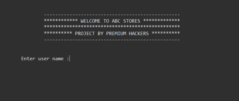
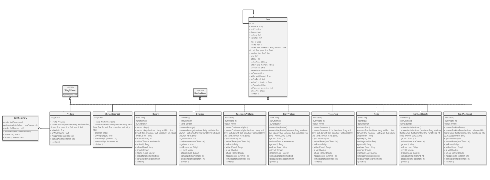
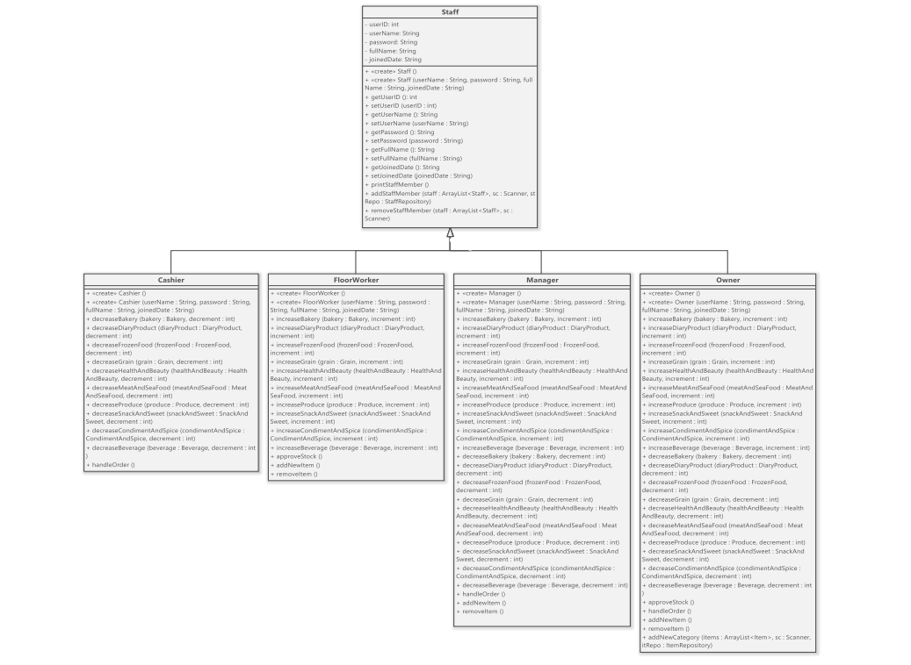
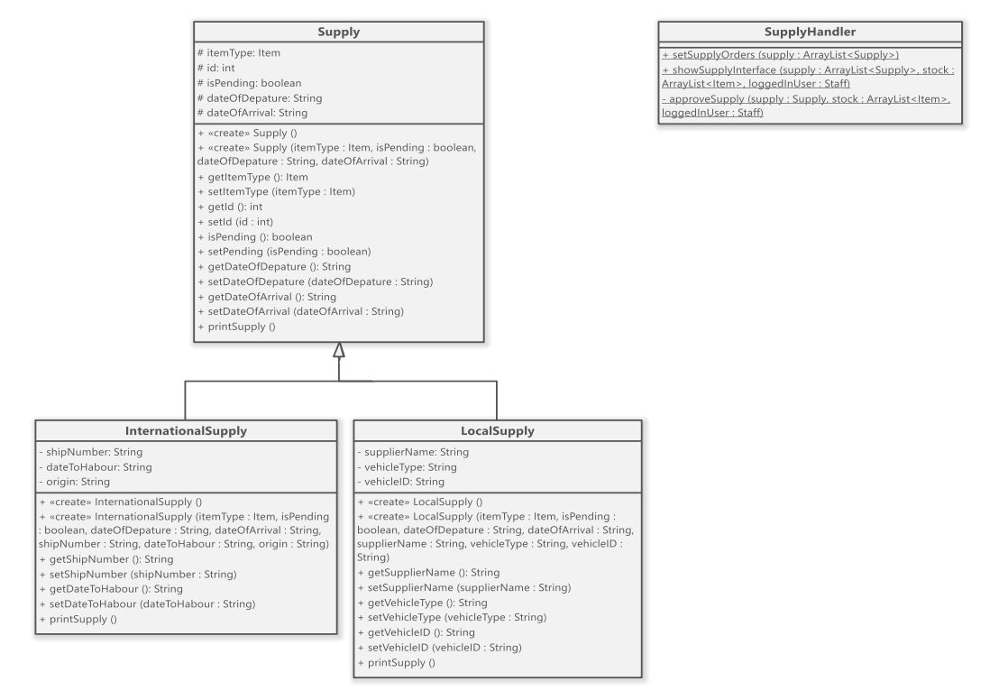
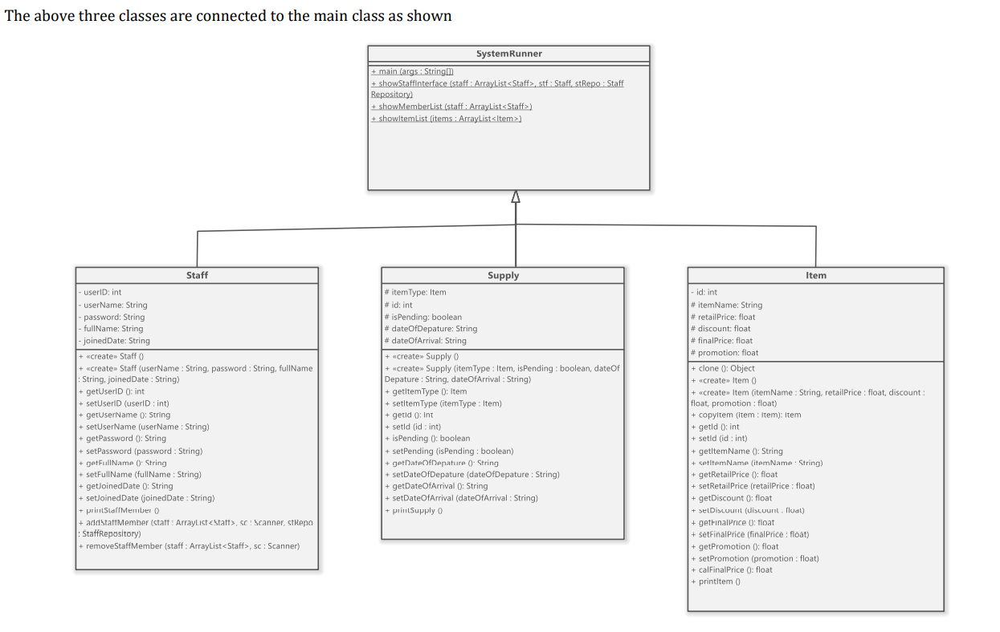

<h1 align="center">
   
  Inventory System
   
</h1>

<h4 align="center">A Full Inventry management system that built in Java programming language in console mode, including Food catogeries, Staff, Stock and Supply.</h4>

  
  
  
   
  <a href="#description">Description</a> •
  <a href="#oop-techniques">OOP Techniques</a> •
  <a href="#limitations">Limitations</a> •
  

## Description

This is a report detailing the process of designing and implementing the inventory system which 
was required to made for an up-and-coming supermarket. It has been managing its inventory 
manually so far by entering details of inventory and sales on spreadsheets one by one by a staff 
member. However, due to the gradual expansion of the business, hiring of more staff and the 
recent increase in demand for online sales due to the pandemic, it has been increasingly difficult 
to keep track of everything manually and security risks have also become a major concern. 
Therefore, it was decided that it is in the best interest of the business to switch to an autonomous 
inventory management system and our team was hired to implement it. It was decided to design 
the system using the computer language Java.   
According to the requirements the system was buildup with three major parts which are the stock, 
supply and the staff.   

- Stock- Mainly the Inventory management system is responsible for storing and managing all 
details regarding the stocks in the inventory. Items in the inventory are divided into 10 major 
categories. Which are produce, Meat & Seafood, Grains, Bakery products, Frozen foods, Dairy 
products, Snacks and Sweets, Beverages, Health & Beauty and Condiments & Spices.    
- Staff - The inventory system is managed by the staff of the supermarket chain. Each staff member 
has a username and password that must be entered in order to access the inventory system. The 
staff members are owner, manager, cashier and the floor worker. Any staff member can enter to 
the system by entering their details, while each member has limitations to access some areas 
according to their position.    
- Supply - The details of the supply chain that brings stock into the inventory are recorded in this 
section. The transportation details and the approvement details, suppliers details belongs here.
Which is mainly divided into two parts as local and international.    
After entering the login screen, the program consists of three major screens for each of the 
sections; Stock, Supply and Staff

## OOP Techniques

- Abstraction: 
Data Abstraction is the property by virtue of which only the essential details are displayed to the 
user. The trivial or the non-essentials units are not displayed to the user. Abstraction classes were 
used when extending some derived classes. Some of the classes were made virtual according to 
the design requirements.   
- Encapsulation:
Encapsulation is a mechanism of wrapping the data (variables) and code acting on the data 
(methods) together as a single unit. In encapsulation, the variables of a class will be hidden from 
other classes, and can be accessed only through the methods of their current class. This concept 
was used in category, stock, staff and supply classes. Separate getters and setters were used to 
access private attributes.   
- Inheritance:
Inheritance is a mechanism in which one object acquires all the properties and behaviors of a 
parent object. The idea behind inheritance is when a new class is created which are built upon 
existing classes when it inherits from an existing class, the methods and fields of the parent class
can be used in the sub classes as well. In the category section all the 10 sub classes (produce, meat 
and sea food, Grains, Bakery products, Frozen foods, Dairy products, Snacks and Sweets, 
Beverages, Health & Beauty and Condiments & Spices) are extended from the item.java parent 
class. In the supply section the local and international sub classes were inherited from the 
supply.java class. Also in the staff section, owner, manager, cashier, floor worker classes were 
inherited from staff.java parent class.   
- Polymorphism:
Polymorphism is the ability of an object to take many forms. To simply put, polymorphism allows 
us to perform the same action in many different ways. In this system the same function 
‘printItem.java’ was used in different category classes by overriding this method. Furthermore, 
many getters and setters were used with same function names to override those methods between 
classes. In the staff class, handleOrder(), addNewItem( ), removeItem( ) functions were used in 
different sub classes using this concept. 

## LIMITATIONS 

As this project was designed by three newly learning students there are some limitations of this 
inventory system comparing with standard inventory systems which are used in supermarkets. 
As it was required to used OOP concepts this was designed as much as possible object oriented. 
But in some cases, it was moved to procedural concepts by us. Also, there is a limit for adding 
dummy data in stock class and for each category. There was another limitation when using the 
exceptions in some cases it was not able to handle the user input validations, because it was much 
difficult for the implementation. In the stock section there was a limitation whether giving a 
promotion or a discount for a product. When entering the discount or promotion in transactions 
user has to decide either there is a discount or a promotion by entering ‘zero’ for one of them. Also, 
the GUI design is limited to a command prompt interface which is not much user friendly

